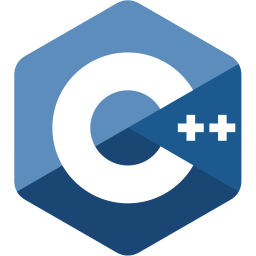

### Hey folks, I'm Jet :stuck_out_tongue_winking_eye:

- a.k.a the most consistent water drinker
- a.k.a the most inconsistent github contributor

I'm a Taiwanese software engineer working in the Netherlands:

- :mortar_board: I'm currently refining my master's graduation project [DPSolver2D][graduationproject]
- :computer:I'm currently building my personal website as a side project
- :book: I'm currently learning more about C++ data structure

---

### Languages and Tools:

### You can also find me on:

 &nbsp;
 &nbsp;

[linkedin]: https://www.linkedin.com/in/jet-chang/
[instagram]: https://www.instagram.com/j900213/
[facebook]: https://www.facebook.com/jet.chang.520
[graduationproject]: https://github.com/j900213/DPSolver2D

---

  
:zap: GitHub Stats

  

